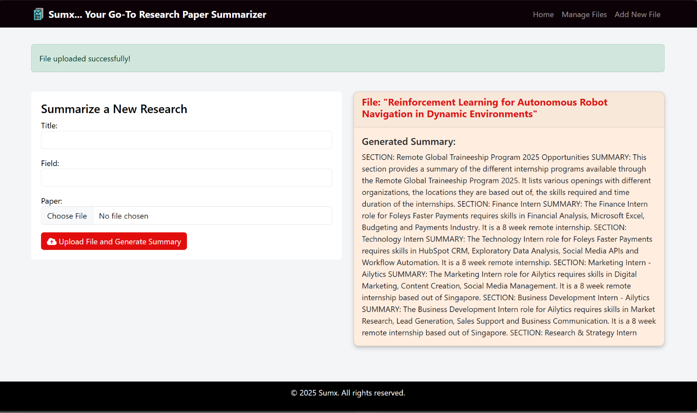

# Project Name: Sumx - Research Paper Summarizer

## Project Overview:
Sumx is an innovative web application designed to streamline the process of summarizing research papers for researchers and students. The platform offers advanced tools for uploading research papers, analyzing content, and generating concise and effective summaries.

## Features:

- User-Friendly Interface: A simple and flexible design that allows users to navigate easily.
- File Management: Users can upload, edit, and delete research papers with ease.
- Summary Generation: The system analyzes texts and produces accurate summaries that reflect the main ideas of the research.
- Multi-Language Support: Supports multiple languages, making it suitable for a wide range of users.

## Target Audience: 
Sumx targets students, researchers, and educators who need to summarize research papers efficiently and quickly.

## Goal:
The aim of the Sumx project is to enhance the academic research experience and provide tools that facilitate access to important information in an organized and user-friendly manner.

## DEMO

